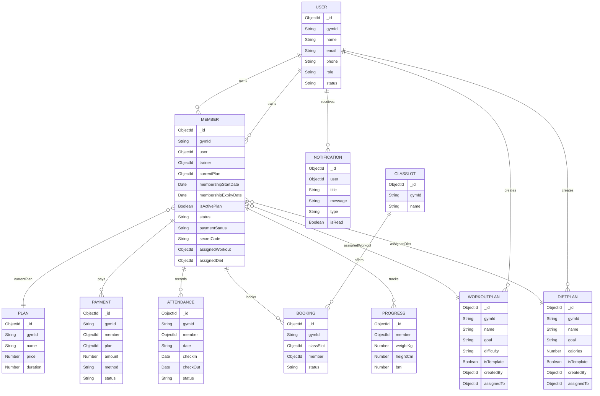

# Gymza ER Diagram and Feature Map

## 1. Overview
This document captures the Gymza application data model, user roles, permissions, and feature coverage for both admin/trainer and member users.

The app is structured with:
- Backend: Express + Mongoose models, controllers, routes, middleware
- Frontend: React with protected pages and sidebar role-based navigation
- Multi-tenancy by `gymId` across all core data models

---

## 2. User Roles and Permissions

### Roles
- `superadmin`
- `admin`
- `trainer`
- `member`

### Role capabilities

#### Admin
- Manage users: create/update/delete members, create trainers
- Manage plans: create/list/update/delete
- Manage workout and diet templates
- Assign workout/diet to members
- Manage member plans: assign, renew, upgrade, cancel, freeze, resume
- Approve members
- Record and manage payments
- View dashboard metrics
- Manage attendance history and manual check-ins
- Manage generic resources: class slots, inventory, branches, referrals
- Access reports and notifications

#### Trainer
- Manage workout and diet templates
- Assign workout/diet to members
- Create and update members
- Approve members
- View members and attendance
- List payments and dues
- Access dashboard metrics
- Manage generic resources (class slots, inventory, branches, referrals)

#### Member
- Sign up and log in
- View and update own profile
- View own attendance
- Check in / check out (with geofencing and secret code support)
- Export attendance
- View assigned workout and diet plans
- View own payments and invoices
- Access payment workflows
- Receive notifications
- Apply referral codes

---

## 3. Core Entities and Attributes

### User
- `gymId` (String, required)
- `name` (String, required)
- `email` (String, required, unique per gym)
- `phone` (String)
- `password` (String)
- `role` (Enum: superadmin, admin, trainer, member)
- `photo` (String)
- `status` (Enum: pending, active, inactive)
- `specialty` (String)
- `address` (String)
- `emergencyContact` (String)
- `refreshTokens` (Array)
- `resetPasswordToken`, `resetPasswordExpire`

### Member
- `gymId` (String)
- `user` (ref: User, unique)
- `trainer` (ref: User)
- `currentPlan` (ref: Plan)
- `membershipStartDate`, `membershipExpiryDate` (Date)
- `isActivePlan` (Boolean)
- `status` (Enum: pending, active, expired, cancelled, inactive, frozen)
- `paymentStatus` (Enum: paid, pending)
- `secretCode` (String, unique)
- `assignedWorkout` (ref: WorkoutPlan)
- `assignedDiet` (ref: DietPlan)
- `frozenAt` (Date)
- `remainingDays` (Number)
- `branchCode` (String)

### Plan
- `gymId` (String)
- `name` (String)
- `price` (Number)
- `duration` (Number, days)
- `features` (Array of String)

### WorkoutPlan
- `gymId` (String)
- `name` (String)
- `goal` (Enum: Fat Loss, Muscle Gain, Strength, General Fitness)
- `difficulty` (Enum: Beginner, Intermediate, Advanced)
- `isTemplate` (Boolean)
- `createdBy` (ref: User)
- `assignedTo` (ref: Member)
- `days` (Array of day objects with exercises)

### DietPlan
- `gymId` (String)
- `name` (String)
- `goal` (Enum: Weight Loss, Muscle Gain, Maintenance)
- `calories` (Number)
- `isTemplate` (Boolean)
- `createdBy` (ref: User)
- `assignedTo` (ref: Member)
- `meals` (breakfast, lunch, dinner, snacks arrays)

### Attendance
- `gymId` (String)
- `member` (ref: Member)
- `date` (String)
- `checkIn`, `checkOut` (Date)
- `status` (Enum: present, completed, absent, late, half-day)
- `faceRecognitionMatched` (Boolean)
- `notes` (String)
- `timezone` (String)
- `location` (checkIn/checkOut lat/lon/accuracy)
- `deletedAt` (Date)
- `auditLogs` (actions recorded by admin/trainer/member)

### Payment
- `gymId` (String)
- `member` (ref: Member)
- `plan` (ref: Plan)
- `amount` (Number)
- `date` (Date)
- `method` (Enum: cash, card, upi, online)
- `status` (Enum: paid, pending)
- `note` (String)
- `invoiceNumber` (String)
- `invoice` (Object)
- `dueDate` (Date)

### Booking
- `gymId` (String)
- `classSlot` (ref: ClassSlot)
- `member` (ref: Member)
- `status` (Enum: booked, cancelled)

### Notification
- `user` (ref: User)
- `title` (String)
- `message` (String)
- `type` (Enum: expiry, payment, general)
- `isRead` (Boolean)

### Progress
- `member` (ref: Member)
- `weightKg` (Number)
- `heightCm` (Number)
- `bmi` (Number)
- `notes` (String)

### Generic Entities
- `ClassSlot`, `InventoryItem`, `Branch`, `Referral`
- All use a generic schema: `gymId`, `name`, `description`, `metadata`

---

## 4. Entity Relationships

```text
User (1) --- (1) Member
User (1) --- (M) Member as trainer
Member (M) --- (1) Plan
Member (M) --- (M) Payment
Member (1) --- (M) Attendance
Member (1) --- (M) Booking
Member (1) --- (0..1) WorkoutPlan (assignedWorkout)
Member (1) --- (0..1) DietPlan (assignedDiet)
User (1) --- (M) WorkoutPlan.createdBy
User (1) --- (M) DietPlan.createdBy
User (1) --- (M) Notification
ClassSlot (1) --- (M) Booking

Gym (gymId) is a top-level tenant key on all records
```

### Relationship Notes
- Every `Member` belongs to exactly one `User` account.
- `Trainer` and `Admin` are stored in `User` but do not have a separate trainer model.
- `WorkoutPlan` and `DietPlan` can exist as templates when `isTemplate=true`.
- Assigned plans for members are copies of templates or custom plans.
- `Payment` updates `Member.paymentStatus` and can activate membership.
- Attendance is protected by geofencing and enforces daily unique records.

---

## 5. ER Diagram


---

## 6. Feature Map by Module

### Authentication
- `POST /api/auth/signup`
- `POST /api/auth/login`
- `POST /api/auth/refresh`
- `POST /api/auth/logout`
- `POST /api/auth/forgot-password`
- `POST /api/auth/reset-password/:token`

### User/Profile
- `GET /api/users/me`
- `PUT /api/users/update-profile`

### Plan Management
- `GET /api/plans`
- `POST /api/plans` (admin)
- `PATCH /api/plans/:id` (admin)
- `DELETE /api/plans/:id` (admin)

### Member Management
- `GET /api/members` (view_member)
- `GET /api/members/search` (view_member)
- `POST /api/members` (create_member)
- `GET /api/members/:id` (view_member / member)
- `PUT /api/members/:id` (update_member)
- `DELETE /api/members/:id` (delete_member)
- `PATCH /api/members/:id/assign-plan` (manage_plans)
- `PATCH /api/members/:id/renew-plan` (manage_plans)
- `PATCH /api/members/:id/upgrade-plan` (manage_plans)
- `PATCH /api/members/:id/cancel-plan` (manage_plans)
- `PATCH /api/members/:id/freeze-plan` (manage_plans)
- `PATCH /api/members/:id/resume-plan` (manage_plans)
- `PATCH /api/members/:id/approve` (approve_member)
- `GET /api/members/profile/me` (member)
- `PATCH /api/members/profile/me` (member)

### Attendance
- `POST /api/attendance/mark` (public via secret code or admin/trainer)
- `POST /api/attendance/check-in` (member)
- `POST /api/attendance/check-out` (member)
- `GET /api/attendance/me` (member)
- `GET /api/attendance/me/today` (member)
- `GET /api/attendance/me/stats` (member)
- `GET /api/attendance/me/export` (member)
- `GET /api/attendance/me/realtime` (member)
- `GET /api/attendance` (admin/trainer)
- `POST /api/attendance/face-verify` (admin/trainer)
- `POST /api/attendance/check-in` (admin/trainer)
- `PATCH /api/attendance/check-out/:id` (admin/trainer)
- `PUT /api/attendance/:id` (admin/superadmin)
- `DELETE /api/attendance/:id` (admin/superadmin)

### Workouts
- `GET /api/workouts/templates` (view_workout)
- `POST /api/workouts/templates` (create_workout)
- `DELETE /api/workouts/:id` (delete_workout)
- `POST /api/workouts/assign` (assign_workout)
- `GET /api/workouts/my-workout` (member)

### Diets
- `GET /api/diets/templates` (view_diet)
- `POST /api/diets/templates` (create_diet)
- `DELETE /api/diets/:id` (delete_diet)
- `POST /api/diets/assign` (assign_diet)
- `GET /api/diets/my-diet` (member)

### Payments
- `GET /api/payments/my-payments` (member)
- `GET /api/payments` (admin/trainer)
- `GET /api/payments/dues` (admin/trainer)
- `GET /api/payments/:id/invoice` (admin/trainer/member)
- `PATCH /api/payments/:id/paid` (admin/trainer)
- `PATCH /api/payments/:id/unpaid` (admin/trainer)
- `POST /api/payments` (admin/trainer)
- `POST /api/payments/online/intent` (admin/trainer/member)
- `POST /api/payments/online/confirm` (admin/trainer/member)

### Booking
- `GET /api/bookings` (admin/trainer/member)
- `POST /api/bookings` (admin/trainer/member)
- `PATCH /api/bookings/:id/cancel` (admin/trainer/member)

### Referral
- `GET /api/referrals` (admin/trainer)
- `POST /api/referrals/apply` (admin/trainer/member)

### Notifications
- `GET /api/notifications` (authenticated)
- `PATCH /api/notifications/:id/read` (authenticated)

### Dashboard
- `GET /api/dashboard/stats` (admin/trainer)

### Generic CRUD Routes
- `GET /api/generic/:entity` (admin/trainer)
- `POST /api/generic/:entity` (admin/trainer)
- `PUT /api/generic/:entity/:id` (admin/trainer)
- `DELETE /api/generic/:entity/:id` (admin)
- Entities: `class-slots`, `inventory`, `branches`, `referrals`

---

## 6. Key Business Flows

### Member lifecycle
1. Signup creates `User` + `Member` (pending)
2. Admin/trainer approves member
3. Admin/trainer assigns plan
4. Payment recorded or confirmed
5. Membership becomes active
6. Expiry job marks membership expired after expiry date

### Attendance flow
- Members can self check-in/out using `memberCheckIn` / `memberCheckOut`
- Attendance may require gym geofence verification (`GYM_LATITUDE`, `GYM_LONGITUDE`, radius)
- Admin/trainer can manually mark check-in/check-out for members
- Daily attendance stored with `status`, `location`, and `auditLogs`

### Workout / Diet management
- Admin/trainer create reusable templates
- They assign templates or custom plans to members
- Members fetch assigned workout/diet via `my-workout` / `my-diet`

---

## 7. Frontend Role Access

### Pages for Admin/Trainer
- Dashboard
- Members
- Attendance
- Workouts & Diet
- Payments
- Trainers (admin only)
- Plans (admin only)
- Settings
- Profile

### Pages for Member
- My Attendance
- Workouts & Diet
- Payments
- Settings
- Profile
- Access restricted / pending approval pages when membership is not active

---

## 8. Notes
- `gymId` is used as tenant scope for all data.
- `User.role` determines route access and permission rules.
- `Member.status` and `Member.paymentStatus` enforce access restrictions.
- `WorkoutPlan` and `DietPlan` support both template and member-specific assigned versions.
- The backend includes scheduled membership expiry and reminder notifications.

---

## 9. Diagram Summary
This project is primarily a gym management SaaS with:
- Member onboarding and approval
- Plan and payment handling
- Attendance tracking with geofence and secret-code support
- Workout and diet plan templates plus member assignments
- Trainer/admin dashboards and member operations
- Basic booking, referrals, notifications, and inventory/branch support

The ER model is built around `User`, `Member`, `Plan`, `WorkoutPlan`, `DietPlan`, `Attendance`, `Payment`, `Booking`, `Notification`, and `Progress`.
